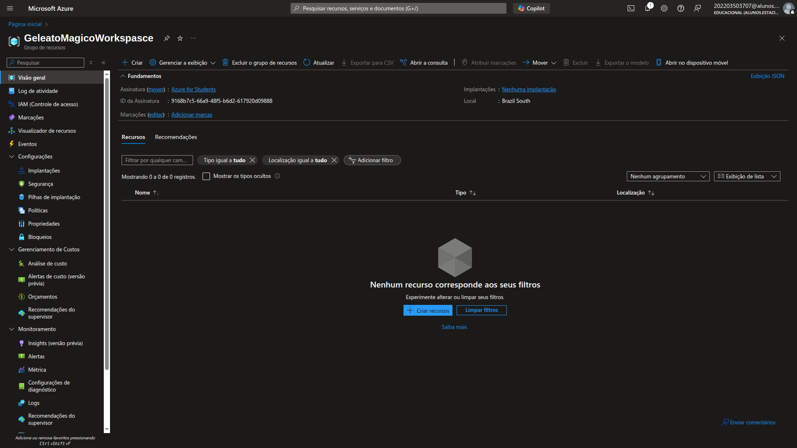
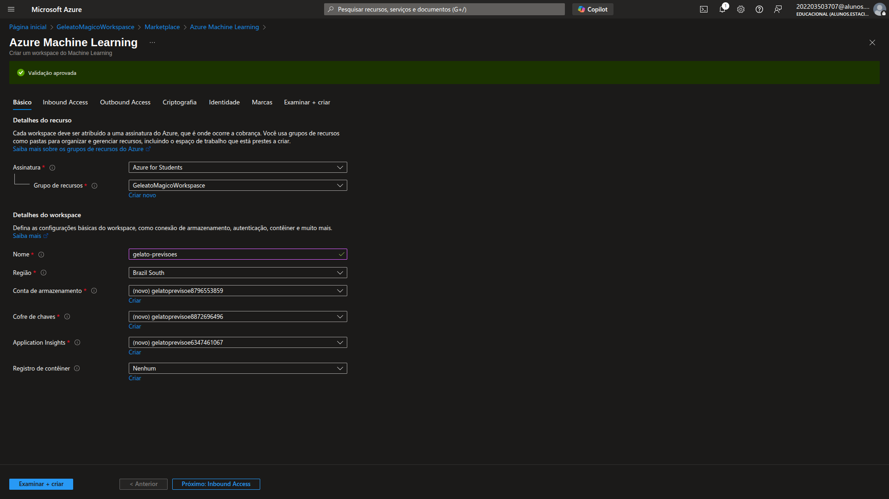
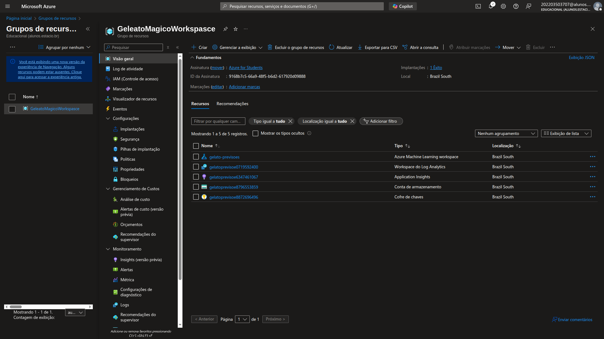
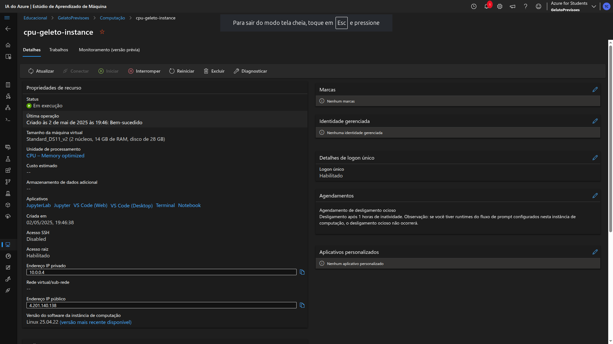
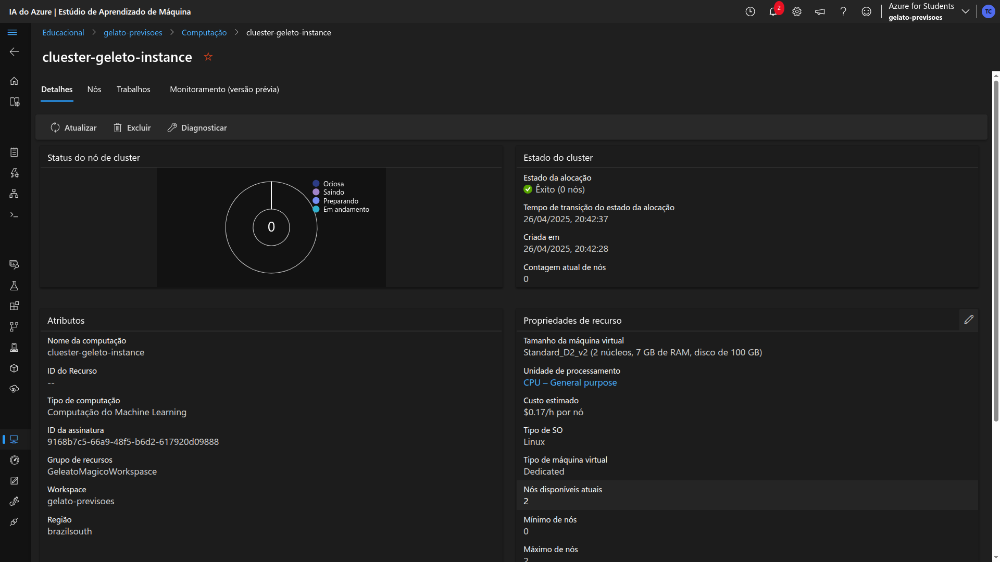
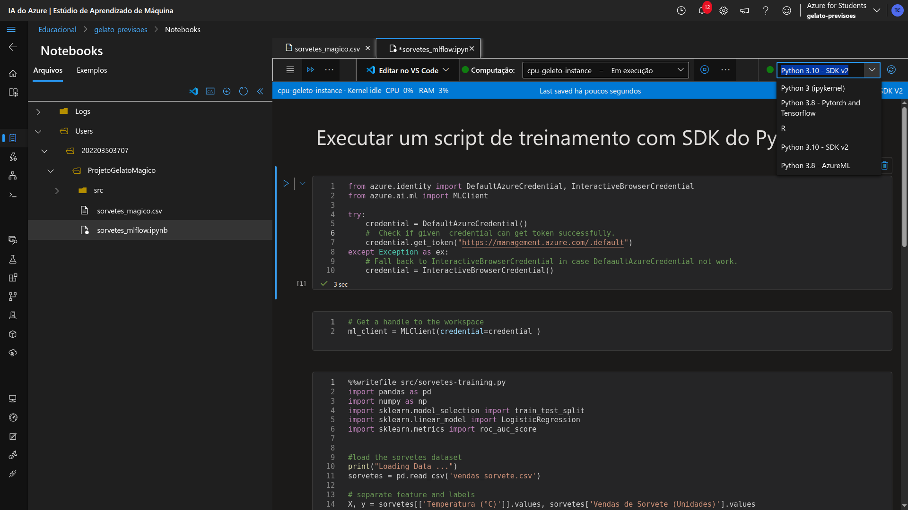

  

  

    <h1 style="margin: 0; font-size: 50px;">Gelato Mágico.</h1>
  

  

    Treinando Seu Primeiro Modelo de Machine Learning para Prever Vendas
  

O documento a seguir descreve o processo de ciração de um modelo de predição de vendas futuras utilizando a plataforma do Azure Machine Learning, durante esse projeto foi utilizado como base o arquivo criado em python, para ciração de dataset (base de dados),sabendo que o objetivo da predição a ser realizada tem como base a quantidade de vendas realizadas conforme a temperatura do dia, foi utilizado então esse código que gera um arquivo **".csv "** , foi criado esse arquivo
[Cria base de dados](src/script_data_set.py). Após a configuração e de ambiente de trabalho, provisioanmento de máquinas, foram utilizadas técnicas distintas para gerar diferentes resultados, 
sendo eles códigos em notebooks python, para computação e criação de scripts e modelos com MLflow, Automated ML com Designer, até o deploy do arquivo conforme veremos durante o documento. 

## Configuração de Workspace, e provisionamento de computação
Durante a confecção do projeto em questão foi utilizado o Azure Machine Learning para criação de um workspace nomeado de 
**"GeleatoMagicoWorkspace"**:

Após a ciração do workspace e utilizando os recursos fornecidos pela Azure,foi criado o recurso "Azure Machine Learning" hospedado nesse espaço de trabalho, sendo nomeado de  

**"gelato-previsoes"**:

Neste estúdio do Azure Machine Leaning foi utilizado as configurações padrões do azure.  
Após a criação do recurso, foi realizado então a configuração de computação, sendo utilizado tanto a computação de instância com CPU, quando o cluster de automação para criar e "rodar" os notebooks diretamente da Azure Machine Learning Studio.  
Para a criação da instância de computação normal foram utilizados os seguintes recursos:  
| Nome | Tamanho da máquina virtual | Unidade de processamento | Custo estimado |
| --- | --- | --- | --- |
| cpu-geleto-instance | Standard_D2_v2 (2 núcleos, 7 GB de RAM, disco de 100 GB) | CPU – General purpose | $0.17/h (ao executar) |

Para a criação do Cluster de computação foram utilizados os seguintes recursos:
| Nome da computacao| Tipo de computação | Tamanho da máquina virtual | Unidade de processamento | Custo estimado | Nº de nós |
| --- | --- | --- | --- | --- | --- |
| cluester-geleto-instance | Computação do Machine Learning | Standard_D2_v2 (2 núcleos, 7 GB de RAM, disco de 100 GB) | CPU – General purpose | $0.17/h por nó | 2 |  

 Ambos os recursos foram criados com o objetivo, de realizar rodar os diferentes modelos e trabalhos que foram criados.  

 ## Scitps e modelos com MLflow
 Após o provisionamento de máquinas virtuais no ambiente Azure, foi realizado a criação de modelos utilizando o MLflow, através de notebooks python, para tal tarefa foi realizado a excução do scritp [Cria base de dados](src/script_data_set.py), para geração do dataset a ser utilizado, bem como foi realizado o a criação de um diretório dentro do ambiente bem upload da pasta contendo o arquivo e notebook python para gerar o Job junto ao MLflow, o arquivo utilizado foi [Script MLflow](src/sorvetes_mlflow.ipynb),ambos os arquivos foram importados para as pastas criadas e os assim como os arquivos. 
 

<table style="text-align: center; width: 100%;">
 <caption><b>Project skils</b></caption>
  <tr>
    <td style="text-align: center;">
      
    </td>
    <td style="text-align: center;">
      
    </td>
    <td style="text-align: center;">
      
    </td>
    <td style="text-align: center;">
      
    </td>
  </tr>
  <tr>
    <td style="text-align: center;">
      
    </td>
    <td style="text-align: center;">
      
    </td>
    <td style="text-align: center;">
      
    </td>
    <td style="text-align: center;">
      
    </td>
  </tr>
</table>

