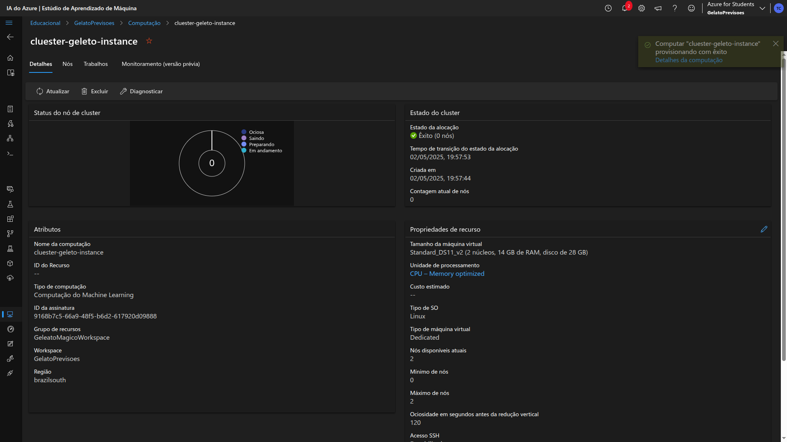
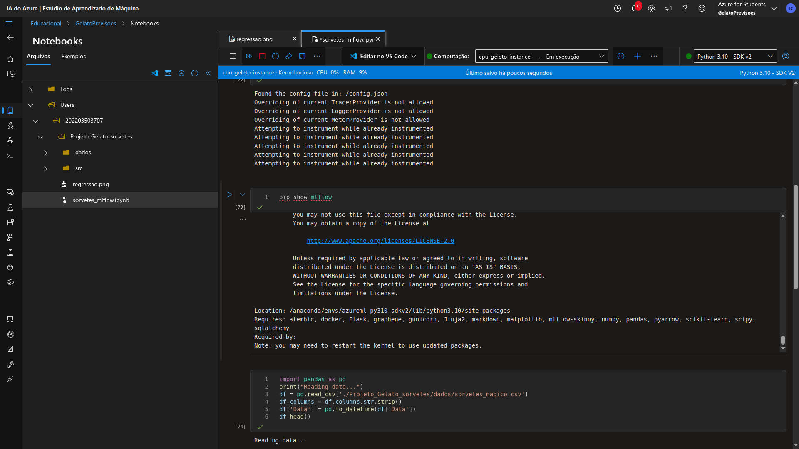
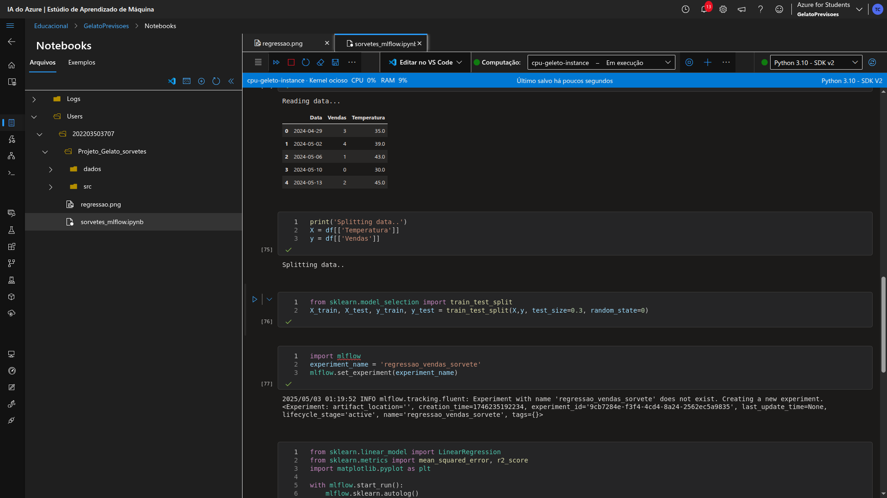
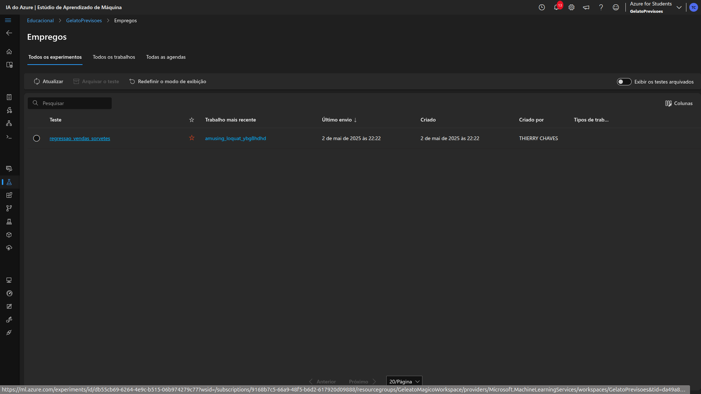
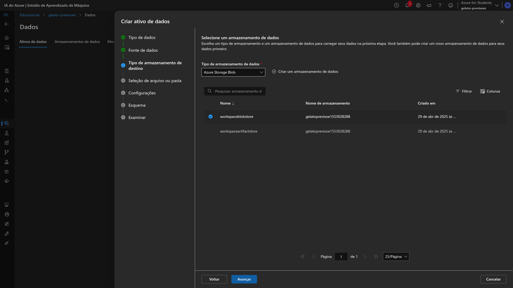
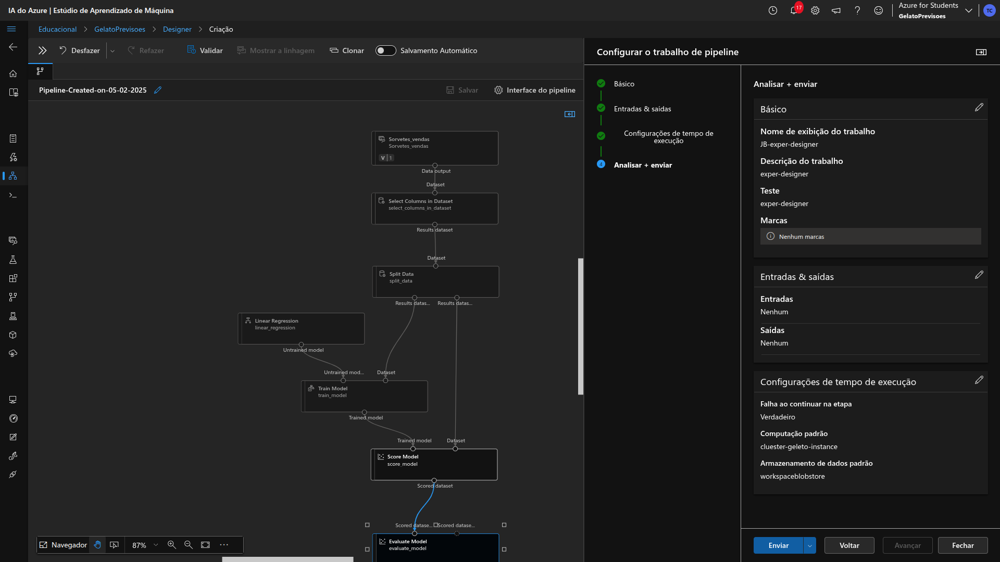

  

  

    <h1 style="margin: 0; font-size: 50px;">Gelato Mágico.</h1>
  

  

    Treinando Seu Primeiro Modelo de Machine Learning para Prever Vendas
  

O documento a seguir descreve o processo de criação de um modelo de predição de vendas futuras, utilizando a plataforma do Azure Machine Learning. Durante esse projeto, foi utilizado como base um arquivo criado em Python para a criação do dataset (base de dados).

Sabendo que o objetivo da predição a ser realizada tem como base a quantidade de vendas conforme a temperatura do dia, foi utilizado um código que gera um arquivo .csv. Esse arquivo foi criado no script:
[Cria base de dados](inputs/src/script_data_set.py).  
Após a configuração do ambiente de trabalho e o provisionamento de máquinas, foram utilizadas técnicas distintas para gerar diferentes resultados, sendo eles: códigos em notebooks Python para computação e criação de scripts e modelos com MLflow, Automated ML com Designer — até o deploy do modelo, conforme veremos ao longo deste documento.

## Configuração do Workspace e Provisionamento de Computação
Durante a elaboração do projeto, foi utilizado o Azure Machine Learning para a criação de um workspace nomeado "GeleatoMagicoWorkspace":

Após a **criação** do workspace e utilizando os recursos fornecidos pela Azure, foi criado o recurso **"Azure Machine Learning"**, hospedado nesse espaço de trabalho, sendo nomeado:

**"gelato-previsoes"**:  
  

Neste estúdio do Azure Machine Learning, foram utilizadas as configurações padrão da Azure.  
Após a criação do recurso, foi realizada então a configuração de computação, utilizando tanto a computação de instância com CPU quanto o cluster de automação, para criar e executar os notebooks diretamente no Azure Machine Learning Studio.

Para a criação da instância de computação normal, foram utilizados os seguintes recursos:

| Nome                | Tamanho da máquina virtual                 | Unidade de processamento  | Custo estimado         |
|---------------------|--------------------------------------------|----------------------------|------------------------|
| cpu-geleto-instance | Standard_DS11_v2 (2 núcleos, 14 GB de RAM, disco de 28 GB) | CPU – General purpose      | $0,00 (ao executar)     |

Para a criação do cluster de computação, foram utilizados os seguintes recursos:

| Nome da computação     | Tipo de computação           | Tamanho da máquina virtual                 | Unidade de processamento | Custo estimado     | Nº de nós |
|------------------------|------------------------------|--------------------------------------------|---------------------------|---------------------|-----------|
| cluster-geleto-instance | Computação do Machine Learning | Standard_DS11_v2 (2 núcleos, 14 GB de RAM, disco de 28 GB) | CPU – Memory optimized     | $0,00/h por nó       | 2         |

Ambos os recursos foram criados com o objetivo de executar os diferentes modelos e trabalhos desenvolvidos.

## Scripts e Pipelines

Após o provisionamento das máquinas virtuais no ambiente Azure, foram criados modelos utilizando o **MLflow**, através de notebooks em Python. Para tal tarefa, foi realizada a execução do script [Cria base de dados](inputs/src/script_data_set.py), responsável pela geração do dataset a ser utilizado.

Além disso, foi criado um diretório dentro do ambiente e realizado o upload da pasta contendo o arquivo e o notebook em Python para gerar o Job com o MLflow. O notebook utilizado foi: [Script MLflow](inputs/sorvetes_mlflow.ipynb).

Ambos os arquivos foram importados para as pastas criadas, assim como os demais arquivos relacionados:

  
  
  

Para o desenvolvimento do notebook em questão, foi tomado como base o arquivo [Labs AML7](https://github.com/MicrosoftLearning/mslearn-azure-ml/blob/main/Labs/07/Track%20model%20training%20with%20MLflow.ipynb).

Após a configuração e adaptação do script para o cenário de **regressão linear**, foi realizado o envio do *input de trabalho* (Job) para o ambiente do Azure Machine Learning. Como resultado, foi gerado um único Job, que teve como saída um documento base e uma imagem ilustrando a regressão linear:

Ao acessar o Job em questão e consultar suas saídas e métricas, obtivemos os seguintes resultados:

Ao final do processo, o treinamento foi concluído com sucesso, gerando o seguinte artefato:

 ## Import de dados

Após a modelagem e criação de pipelines, foi realizada a criação de um modelo com base em dados diretamente na plataforma do Azure Machine Learning, importando o dataset para criação futura de ML automatizado, bem como via Designer:

  
  
  
  
  
  
  

---

## Criando trabalho com Auto ML

Com os dados devidamente importados no ambiente, foi dado início à configuração do Auto ML. O experimento em questão foi nomeado de:

**"venda_sorves_automl"**  

Para o experimento, foi selecionado o modelo de **regressão**, visto que o objetivo era realizar uma previsão com base no histórico de temperatura em relação às vendas de sorvete:

Foi escolhido apenas o algoritmo **XGBoostRegressor**. Também foi configurado que a variável de previsão seria as **vendas**:

Limites de tempo e utilização de nós também foram configurados:

Ao final, foi selecionado o tipo de computação a ser utilizada, sendo ela a **instância de cluster previamente provisionada e configurada**:

Com tudo configurado, foi iniciada a execução do trabalho criado pelo AutoML:

Após o tempo limite ser atingido, o experimento gerou **17 trabalhos filhos**, utilizando diversos algoritmos para o treinamento:

  

Conforme o **Normalized Root Mean Squared Error – NRMSE**, o modelo de melhor desempenho foi o **"VotingEnsemble"**, com um NRMSE de **0.28097**. Ao acessar suas métricas, visualizamos o seguinte gráfico:

## Criando trabalho com Designer

De posse dos dados da [base de dados](#import-de-dados), que foi previamente carregada no ambiente, foi gerado também um modelo a partir da ferramenta de **Designer** no Azure Machine Learning. Utilizando o modelo em questão, foi criado um Designer que carrega a base de dados, seleciona as colunas desejadas. A base de dados foi carregada previamente com todos os dados existentes do arquivo carregado. Essa funcionalidade é útil para realizar o processo de **normalização de dados**.

Posteriormente, foi realizada a divisão para treinamento do modelo em **80%** dos dados, deixando **20%** para validação posterior. Após o **split** do modelo, ele foi enviado para treinamento, utilizando a coluna **Vendas** como **target** e o tipo de previsão como **regressão linear**. Com o modelo treinado, foram utilizadas as opções de **Score model** e **Evaluate model**, finalizando assim a modelagem do experimento.

Com o modelo desenhado, foi dado início à configuração e envio do trabalho para gerar um experimento/job, nomeado de **"JB-exper-designer"**.

  

Foi configurado para ser executado no **cluster de computação**.

  

E enviado para processamento do modelo.

  

Com a configuração realizada e o trabalho enviado, podemos notar que o mesmo teve sucesso em criar o trabalho **"JB-exper-designer"**, conforme esperado. Agora, na funcionalidade de **"Empregos"**, contamos com os 3 modelos distintos, cada um criado por uma funcionalidade do Azure Machine Learning Studio.

Com o modelo treinado, podemos visualizar, através da plataforma, tanto os algoritmos gerados, como também, de forma visual, no **box** os modelos de previsões realizadas. No modelo em questão, no **Scored_dataset**, tivemos os seguintes resultados.

---

## Publicando Modelos

Ao final, podemos escolher os melhores modelos e publicá-los futuramente de maneira simples e rápida. Sobre o job criado e escolhido, podem ser selecionadas **3 opções de publicação**: **terminal em tempo real**, **ponto de extremidade do lote** e **Serviço web**.

  

Esses modelos poderão ser consultados futuramente no **ponto de extremidade**.

## Conclusão & Insights Obtidos

O **Azure ML** oferece três caminhos simples para criar modelos preditivos: **notebooks Python com MLflow**, **Designer drag‑and‑drop** e **AutoML totalmente automatizado**.

1. **Notebooks + MLflow** – você usa seu código Python habitual e registra programas, experimentos e versões de modelo de forma programática, mas integrado ao portal do Azure ML.
2. **Designer (UI drag‑and‑drop)** – monta pipelines visuais conectando módulos de pré‑processamento, treino e avaliação sem escrever nenhuma linha de código.
3. **AutoML** – basta apontar o dataset e escolher uma métrica; o serviço testa dezenas de algoritmos em paralelo e entrega o melhor modelo pronto para deploy.

### Insight

Podemos usar o Azure Machine Learning para gerar análises preditivas de forma descomplicada. Graças às opções do **Designer** e do **AutoML**, posso:

- Importar qualquer base de dados e, com alguns cliques, treinar modelos usando o algoritmo mais adequado e de melhor performance.
- Aplicar esses modelos em cenários reais — como previsão de vendas de sorvete, análise de comportamento de clientes ou definição de promoções de produtos alimentícios com base na previsão do tempo e no histórico de vendas.
- Escalar o processamento em nuvem para obter resultados rápidos e precisos, sem me preocupar com infraestrutura.

<table style="text-align: center; width: 100%;">
 <caption><b>Project skils</b></caption>
  <tr>
    <td style="text-align: center;">
      
    </td>
    <td style="text-align: center;">
      
    </td>
    <td style="text-align: center;">
      
    </td>
    <td style="text-align: center;">
      
    </td>
  </tr>
  <tr>
    <td style="text-align: center;">
      
    </td>
    <td style="text-align: center;">
      
    </td>
    <td style="text-align: center;">
      
    </td>
    <td style="text-align: center;">
      
    </td>
  </tr>
</table>

